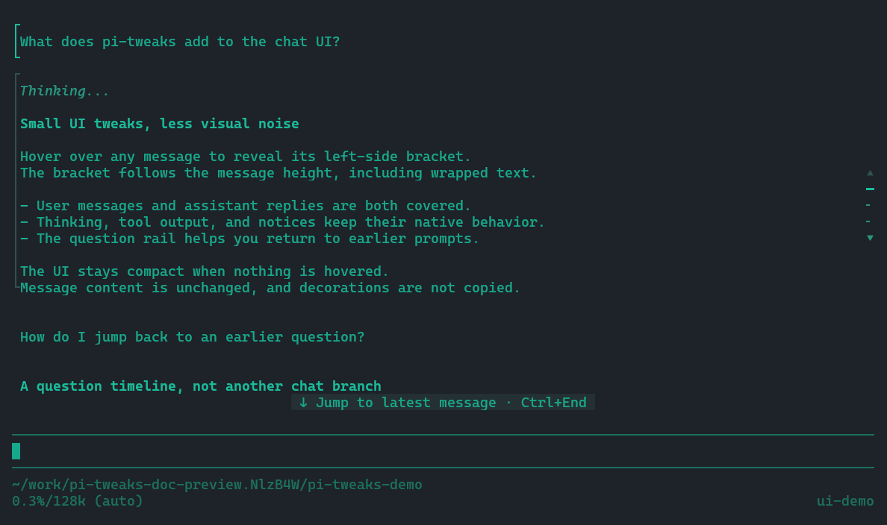
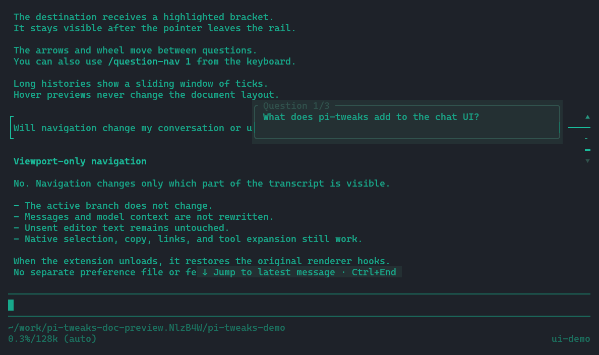
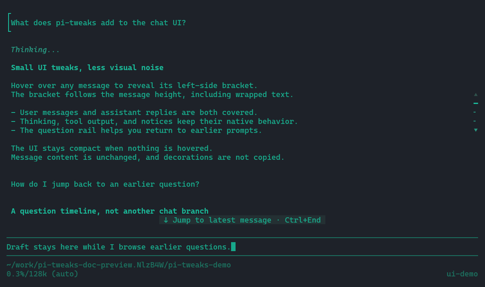

# pi-tweaks

Small fullscreen UI tweaks for Pi.

## Install

With Pi already installed, run:

```bash
pi install git:github.com/douglarek/pi-tweaks
```

Start Pi normally, or run `/reload` in an existing session. The extension activates automatically in **fullscreen** mode; no extra plugin configuration is needed.

If you previously copied `pi-tweaks` into `~/.pi/agent/extensions/`, remove that manual copy before using the Git package to avoid loading the extension twice.

To update or uninstall:

```bash
pi update git:github.com/douglarek/pi-tweaks
pi remove git:github.com/douglarek/pi-tweaks
```

## What we tweak

### Message hover brackets

Hover over any chat message to reveal a subtle left-side bracket spanning the entry. User messages, assistant text, thinking, tool calls/results, command output, custom entries, summaries, warnings, and status notices are all covered.



The muted bracket follows the hovered message. A highlighted bracket identifies the question selected through navigation.

### Question timeline and previews

Each short tick on the right represents a user question. Hovering extends the tick to the left and shows a wrapped preview of the original prompt, making it easier to click without shifting the rail or reflowing the transcript.



The current question is highlighted, and long conversations use a sliding tick window instead of overlapping markers. Preview labels are in English; question text remains in its original language.

### Viewport navigation

Click a tick to scroll to its question. The destination message keeps a highlighted left-side bracket so it is easy to identify after the pointer leaves the rail; manual scrolling clears that destination marker.



The arrows and mouse wheel over the rail move between questions. `/question-nav 3` provides keyboard-only navigation to the third question.

Navigation only changes the viewport. It does not change the active conversation branch, message history, model context, or the editor's draft.

### Native interactions stay native

Text selection/copy, links, thinking expansion, tool expansion, keyboard focus, and overlays remain on Pi's normal input path. Brackets and previews are screen decorations, not transcript text.

## Suggested palette for hover brackets

The screenshots use the optional **grok-transparent** palette: teal text, subtle message borders, and terminal-default message/tool backgrounds. `pi-tweaks` does not require this palette and works with Pi's other themes.

To use it, save the following JSON as `~/.pi/agent/themes/grok-transparent.json`, then choose **grok-transparent** in `/settings` → **Theme**. The screenshot terminal also uses `#17a88b` as its default foreground and `#1e2229` as its default background. Window transparency is controlled by the terminal, not by this JSON.

<details>
<summary>grok-transparent.json</summary>

```json
{
	"$schema": "https://raw.githubusercontent.com/earendil-works/pi/main/packages/coding-agent/src/modes/interactive/theme/theme-schema.json",
	"name": "grok-transparent",
	"appearance": "dark",
	"vars": {
		"text": "#17a88b",
		"teal": "#1abc9c",
		"muted": "#289681",
		"dim": "#1b7160",
		"blue": "#1d99f3",
		"orange": "#f67400",
		"red": "#d96b73",
		"editorBorder": "#1b7160",
		"selectedBg": "#243033",
		"userBg": "#222c30",
		"customBg": "#23282f",
		"pendingBg": "#22272e",
		"successBg": "#202b2c",
		"errorBg": "#2d252a"
	},
	"colors": {
		"accent": "teal",
		"border": "editorBorder",
		"borderAccent": "text",
		"borderMuted": "#31524d",
		"success": "teal",
		"error": "red",
		"warning": "orange",
		"muted": "muted",
		"dim": "dim",
		"text": "text",
		"thinkingText": "muted",
		"selectedBg": "selectedBg",
		"scrollbarTrack": "#293e3d",
		"scrollbarThumb": "editorBorder",
		"searchMatchBg": "#403020",
		"searchMatchText": "orange",
		"userMessageBg": "",
		"userMessageText": "text",
		"customMessageBg": "",
		"customMessageText": "text",
		"customMessageLabel": "teal",
		"toolPendingBg": "",
		"toolSuccessBg": "",
		"toolErrorBg": "",
		"toolTitle": "orange",
		"toolOutput": "text",
		"mdHeading": "teal",
		"mdLink": "blue",
		"mdLinkUrl": "muted",
		"mdCode": "teal",
		"mdCodeBlock": "text",
		"mdCodeBlockBorder": "editorBorder",
		"mdQuote": "muted",
		"mdQuoteBorder": "editorBorder",
		"mdHr": "editorBorder",
		"mdListBullet": "teal",
		"toolDiffAdded": "teal",
		"toolDiffRemoved": "red",
		"toolDiffContext": "muted",
		"syntaxComment": "dim",
		"syntaxKeyword": "orange",
		"syntaxFunction": "teal",
		"syntaxVariable": "text",
		"syntaxString": "teal",
		"syntaxNumber": "orange",
		"syntaxType": "blue",
		"syntaxOperator": "muted",
		"syntaxPunctuation": "muted",
		"thinkingOff": "editorBorder",
		"thinkingMinimal": "editorBorder",
		"thinkingLow": "editorBorder",
		"thinkingMedium": "editorBorder",
		"thinkingHigh": "editorBorder",
		"thinkingXhigh": "editorBorder",
		"thinkingMax": "editorBorder",
		"bashMode": "orange"
	},
	"export": {
		"pageBg": "#1e2229",
		"cardBg": "userBg",
		"infoBg": "pendingBg"
	}
}
```

</details>

## Current scope

- Fullscreen mode; tested with Pi **1.0.4**.
- The rail appears with at least two rendered questions and enough terminal space. Skill headers and their accompanying question count as one user turn.
- Both tweaks are active whenever the extension is loaded; no separate switches or preference files.
- Runtime hooks and temporary gutter sizing are scoped to active instances and restored on unload/reload. Pi's installed source files are not modified. Private TUI hooks may require adaptation after Pi upgrades.

Screenshots are captured from the actual Pi CLI in an isolated Kitty window using a synthetic demo conversation. They contain no private chat or real model requests.
